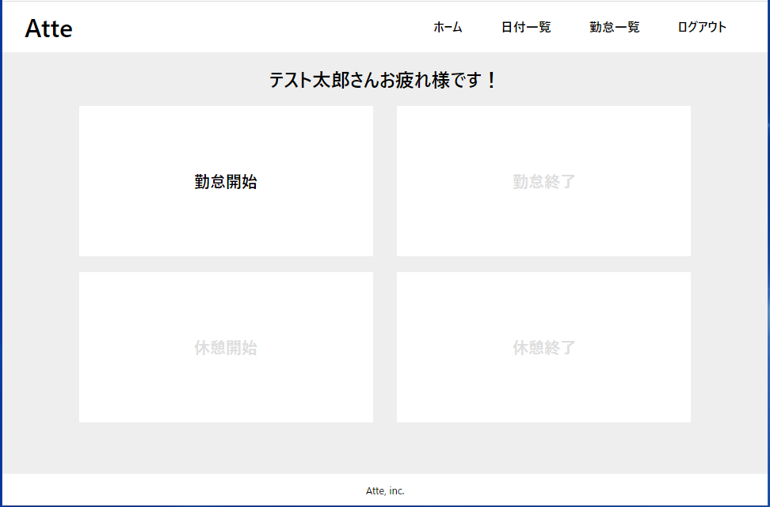

# coachtech-advanced-term-project
COACHTECH advancedターム　勤怠管理システム「Atte(アット)」

## プロジェクト概要
[COACHTECH](https://coachtech.site/)のadvancedタームにて作成し、

コードをgithub、及びサイトをHEROKUで公開しています。

「Atte」に会員登録を行ったユーザの勤怠管理を行います。

## デモ

## 使い方
[Atte](http://dry-meadow-82347.herokuapp.com/)

1. 上記サイトにアクセスします。
2. 会員登録より会員登録を行います。(登録済の場合、ログインページからログインします)
3. ログイン後のページ構成は以下の3つに分かれています。
    * ホーム(打刻ページ)
        * 勤怠の打刻を行います。
        * 日を跨いだ時点で翌日の出勤操作に切り替わります。
        * 休憩は1日に何度も行うことができますが、一覧では1日の勤怠が1行で表示されます。 
    * 日付別勤怠一覧(日付一覧ページ)
        * Atteに登録しているユーザ全員の日付毎の勤怠一覧を表示します。
        * 初期表示は当日の一覧です。
    * 勤怠一覧
        * ログインしたユーザの月毎の勤怠一覧を表示します。
        * 初期表示は当月の一覧です。

## 環境
* Laravel Framework: 8.76.2
* mysql server version: 10.4.20

## 文責
* 作成者：高橋諒
